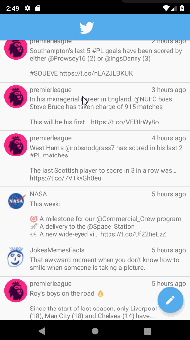

# *SimpleTweet*

**SimpleTweet** is an Android app that allows users to view their Twitter timeline. The app utilizes [Twitter REST API](https://dev.twitter.com/rest/public).

## Features

- User can **sign in to Twitter** using OAuth login
- User can **view tweets from their home timeline**
  - User is displayed the username, name, and body for each tweet
  - User is displayed the [relative timestamp](https://gist.github.com/nesquena/f786232f5ef72f6e10a7) for each tweet "8m", "7h"
- User can refresh tweets timeline by pulling down to refresh
- User can **compose and post a new tweet**
  - User can click a “Compose” icon in the Action Bar on the top right
  - User can then enter a new tweet and post this to twitter
  - User is taken back to home timeline with **new tweet visible** in timeline
  - Newly created tweet should be manually inserted into the timeline and not rely on a full refresh
  - User can **see a counter with total number of characters left for tweet** on compose tweet page
- Used **"Twitter branded" colors and styles**
- User can **pull down to refresh tweets timeline**
- User sees an **indeterminate progress indicator** when any background or network task is happening
- Used Parcelable instead of Serializable using the popular [Parceler library](http://guides.codepath.org/android/Using-Parceler).

## App Walkthrough

Here's a walkthrough of implemented features:

GIF created with [LiceCap](http://www.cockos.com/licecap/).

## Open-source libraries used

- [Android Async HTTP](https://github.com/codepath/CPAsyncHttpClient) - Simple asynchronous HTTP requests with JSON parsing
- [Glide](https://github.com/bumptech/glide) - Image loading and caching library for Android

